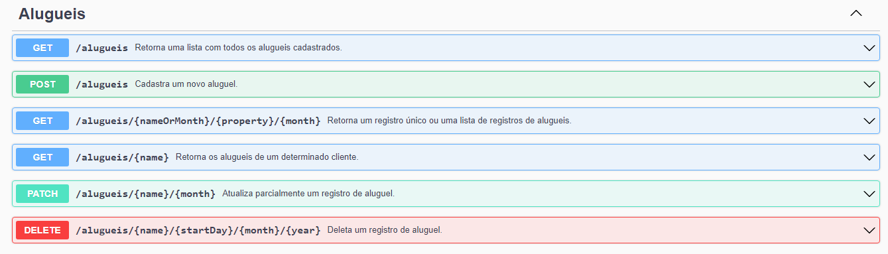
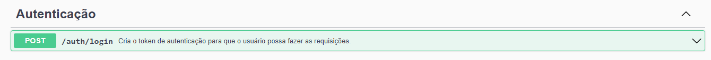
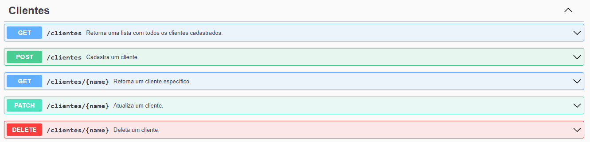
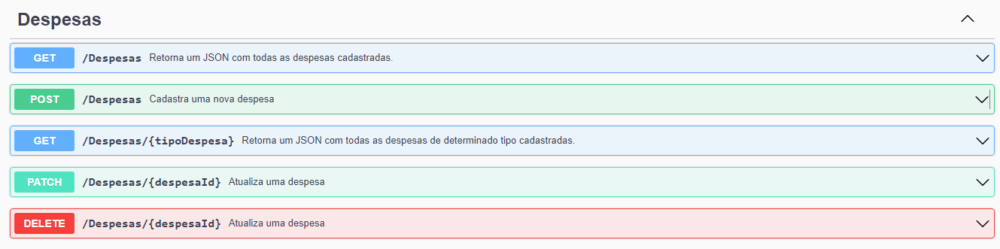
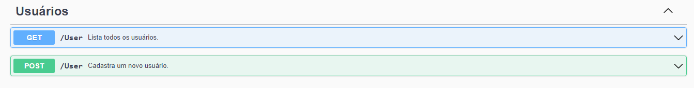

# API para gerenciamento de informações

Criei essa API com a utilização do framework NestJS, TypesCript e utilização de TypeORM e MySQL, com o intuito de auxiliar no gerenciamento de um determinadoe spaço de lazer com piscina, posteriormente pretendo fazer uma aplicação web que consuma essa API.

A API está totalmente documentada com a utilização do SWAGGER/OpenAPI e todos os endpoints e entidades estão mapeados no mesmo.

Para acessar a documentação siga os seguintes passos:

altere no app.module.ts as configurações referentes à conexão com banco de dados para aquelas às quais você usa e crie o banco.

```typescript
import { Module } from '@nestjs/common';
import { AppController } from './app.controller';
import { AppService } from './app.service';
import { TypeOrmModule } from '@nestjs/typeorm';
import { Alugueis } from './alugueis/alugueis.entity';
import { AlgueisModule } from './alugueis/alugueis.module';
import { Clientes } from './clientes/clientes.entity';
import { ClientesModule } from './clientes/clientes.module';
import { UserModule } from './user/user.module';
import { User } from './user/user.entity';
import { AuthModule } from './auth/auth.module';
import { Despesa } from './despesas/despesas.entity';
import { DespesasModule } from './despesas/despesas.module';

@Module({
  imports: [
    TypeOrmModule.forRoot({
      type: 'mysql',
      host: 'localhost',
      port: suaporta,
      username: 'seuusário',
      password: 'suasenha',
      database: 'piscina',
      entities: [Alugueis, Clientes, User, Despesa],
      synchronize: true,
    }), AlgueisModule, ClientesModule, UserModule, AuthModule, DespesasModule
  ],
  controllers: [AppController],
  providers: [AppService],
})
export class AppModule {}

```
em seguida, execute a aplicação com o seguinte comando:

```
npm run start:dev
```

e em seguida acessando em seu navegador o link: http://localhost:3000/api#/

## Autenticação

Para a realização de operações em todos os endpoints da API, é necessário primeiro realizar autenticação via requisição POST passando login e senha, para que seja gerado um token de acesso, com duração máxima de 1h. Esse token deve ser repassado em todos os headers de requisição HTTP, devidamente configurados para que você tenha autorização para realizar alterações no banco ou solicitar informações ao mesmo.

Também é necessário que você configure a variável de ambiente JWT_SECRET em um arquivo .env ou diretamente nas variáveis de ambiente do seu sistema operacional.

Para configurar o JWT_SECRET execute o script generateToken.ts, depois atribua o valor à variável JWT_SECRET.

## Dos Endpoints

Os seguintes endpoints são implementados na API:

- Alugueis:



- Autenticação:



- Clientes:



- Despesas: 



- Usuários:



Esta é a API implementada, espero que tenha gostado! :)


